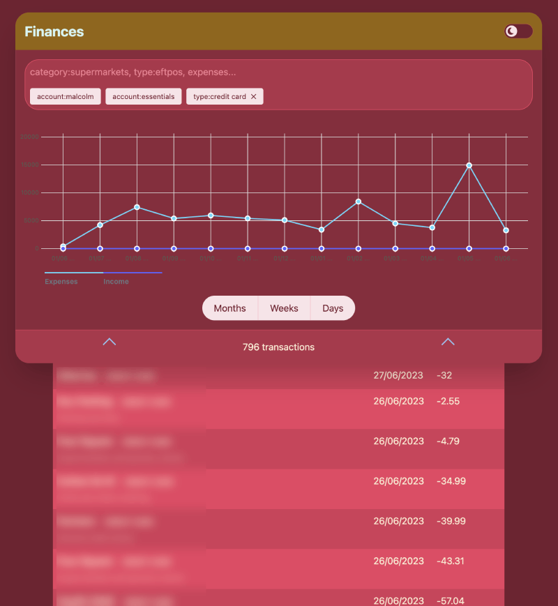

# Finances App

This simple little service shows a summary of your finances over the last
couple years.

## Technology

* Data comes from [Akahu](https://www.akahu.nz/), which provides an API to
access all the banks in NZ. It's set up for just a personal account, so the
app is not multi-tenanted.
* [SvelteKit](https://kit.svelte.dev/) is the framework behind the app,
because I wanted to dig a little deeper into Svelte.
* [Tailwind](https://tailwindcss.com/) for styling, with the
[Skeleton](https://www.skeleton.dev/) UI toolkit
* Database is a simple [SQLite](https://www.sqlite.org/index.html) database
because how can you not love SQLite?
* [Kysely](https://kysely.dev/) because I didn't want an ORM but I wanted
typesafety in my SQL queries

## Usage

0. Set up an Akahu account and get your API key, put in `.env` like so:
```
VITE_AKAHU_APP_TOKEN=app_token_...
VITE_AKAHU_USER_TOKEN=user_token_...
```
1. `npm install`
2. `npm run dev`
3. Visit http://localhost:5173

## Example

